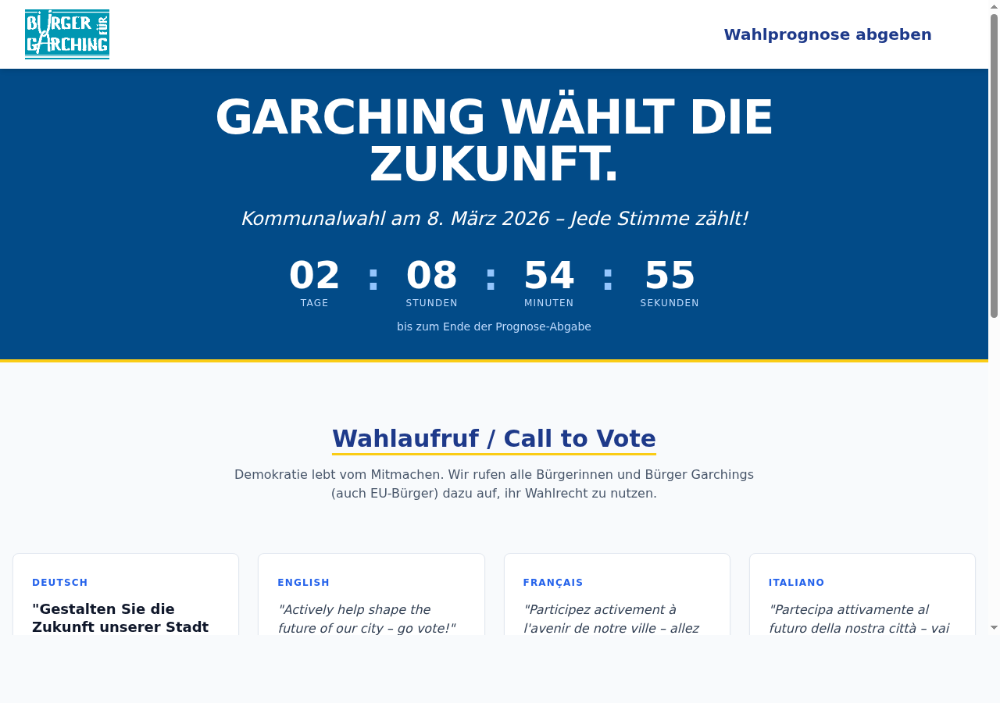
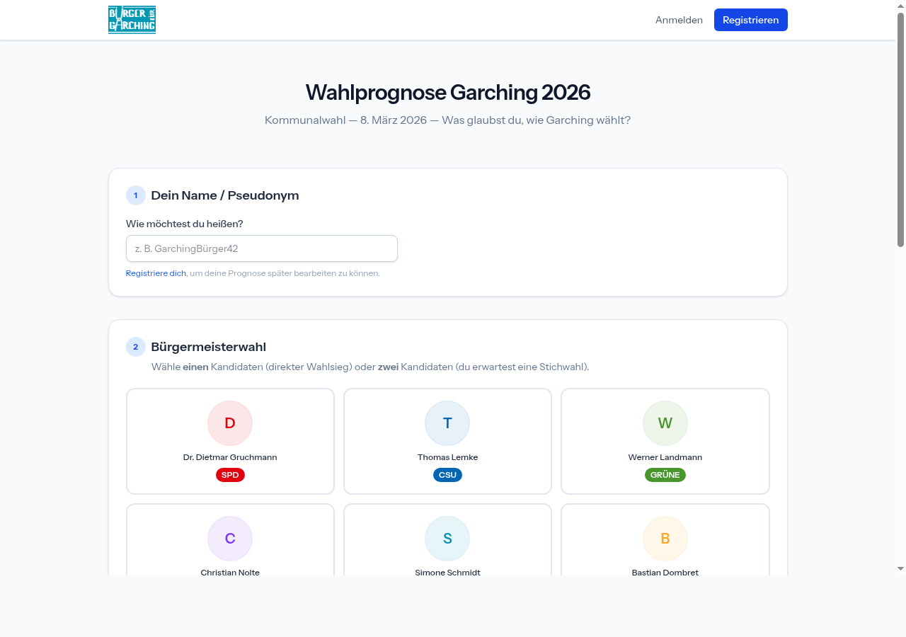

# Wahlprognose Garching 2026

> **Entstehungsgeschichte:** Dieses Projekt wurde von Norbert Fröhler (kein professioneller Programmierer) mithilfe von **Claude Code** (Anthropic) in ca. **5 Stunden** entwickelt. Claude Code ist ein KI-gestützter Coding-Assistent, der direkt im Terminal läuft und Dateien lesen, schreiben und ausführen kann. Ohne dieses Tool wäre die Umsetzung in dieser Zeit und Qualität nicht möglich gewesen. Verwendete Version: **Claude Sonnet 4.6** — eingesetzt für Architekturentscheidungen, Code-Generierung, Datenbankdesign, Blade-Views, Livewire-Komponenten, Tests und diese Dokumentation.

> [!NOTE]
> **Die Live-Version unter `wahlprognose.buerger-fuer-garching.de` ist nach der Kommunalwahl 2026 abgeschaltet worden.**
> Dieses Repository dient als **Demonstrationsversion** und Vorlage für künftige Wahljahre. Der Code kann als Basis für ein neues Wahlprognose-Projekt zur nächsten Kommunalwahl wiederverwendet werden.

---

Inoffizielle Bürgerschätzung zur Kommunalwahl Garching bei München am **8. März 2026**.

Bürgerinnen und Bürger können vor der Wahl ihre persönliche Einschätzung zur Sitzverteilung im Stadtrat und zur Bürgermeisterwahl abgeben. Nach Ablauf der Abgabefrist werden die aggregierten Prognosen öffentlich sichtbar.

---

## Screenshots

| Startseite mit Countdown | Prognose-Formular |
| --- | --- |
|  |  |

---

## Features

- **Bürgermeisterwahl** — 1 Kandidat (Direktsieg) oder 2 Kandidaten (Stichwahl), optionaler Stichwahl-Favorit
- **Stadtratswahl** — Verteilung von genau 24 Sitzen auf 6 Parteien; Counter aktualisiert sich sofort via Alpine.js
- **Keine Pflichtregistrierung** — Pseudonym genügt für eine anonyme Prognose
- **Bearbeitungsfenster** — Registrierte Nutzer können bis zur Deadline ihre Prognose anpassen
- **Ergebnisseite** — Aggregierte Auswertung nach Ablauf der Abgabefrist
- **Admin-Bereich** — Prognosen-Übersicht und CSV-Export für Admins

## Tech-Stack

| Schicht | Technologie |
|---|---|
| Backend | PHP 8.4, Laravel 12 |
| Reaktivität | Livewire 4, Alpine.js |
| UI-Komponenten | Flux UI v2 |
| Styling | Tailwind CSS v4 |
| Build | Vite 7 |
| Auth | Laravel Fortify (2FA-fähig) |
| Datenbank | SQLite (Dev) / MySQL (Prod) |
| Tests | Pest v4 |

---

## Schnellstart

```bash
# Abhängigkeiten installieren
composer install && npm install

# Umgebung konfigurieren
cp .env.example .env
php artisan key:generate

# Datenbank vorbereiten
php artisan migrate
php artisan db:seed

# Entwicklungsserver starten (artisan + queue + pail + vite)
composer dev
```

---

## Befehle

| Befehl | Beschreibung |
|---|---|
| `composer dev` | Vollständige Dev-Umgebung starten |
| `composer test` | Testsuite ausführen (config:clear → pint → artisan test) |
| `composer lint` | Code-Stil automatisch korrigieren (Pint) |
| `npm run build` | Frontend-Assets für Produktion bauen |
| `php artisan migrate` | Datenbankmigrationen ausführen |
| `php artisan db:seed` | Parteien + Kandidaten einspielen |
| `php artisan test --filter=TestName` | Einzelnen Test ausführen |

---

## Routen

| URL | Beschreibung | Auth |
|---|---|---|
| `/` | Startseite mit Countdown; leitet nach Deadline auf `/ergebnisse` weiter | — |
| `/prognose` | Prognose-Formular (Gäste + Nutzer) | — |
| `/ergebnisse` | Aggregierte Ergebnisseite aller Prognosen | — |
| `/datenschutz` | Datenschutzerklärung | — |
| `/impressum` | Impressum | — |
| `/dashboard` | Persönliches Dashboard + Gesamtübersicht | auth |
| `/dashboard/export` | CSV-Export aller Prognosen (inkl. Userdaten) | auth + admin |
| `/admin/prognosen` | Admin-Übersicht aller Prognosen | auth |
| `/settings/*` | Profil, Passwort, Erscheinungsbild, 2FA | auth |

---

## Benutzerrollen

| Rolle | Kennzeichen | Fähigkeiten |
|---|---|---|
| Gast | nicht eingeloggt | Prognose abgeben (kein nachträgliches Update) |
| Nutzer | `is_admin = false` | Prognose abgeben + bis Deadline bearbeiten, Dashboard einsehen |
| Admin | `is_admin = true` | Alles + CSV-Export, Admin-Prognosen-Übersicht |

Admin-Rechte vergeben:

```bash
php artisan tinker
>>> \App\Models\User::where('email', 'mail@example.com')->update(['is_admin' => true]);
```

---

## Konfiguration

Die Abgabe-Deadline wird über `config/forecast.php` → Key `edit_deadline` gesteuert. Standard: `2026-03-07 23:59:59`.

Nach Ablauf der Deadline:

- Startseite (`/`) leitet automatisch auf `/ergebnisse` weiter
- Das Prognose-Formular wird read-only (kein Submit-Button)
- Der Countdown auf der Startseite zeigt "Prognosephase abgelaufen"

---

## Weiterführende Dokumentation

| Datei | Inhalt |
|---|---|
| [docs/datenmodell.md](docs/datenmodell.md) | ER-Diagramm, Tabellenbeschreibungen, Eloquent-Relations, Seeder |
| [docs/komponenten.md](docs/komponenten.md) | Alle Livewire-Komponenten und Controller im Detail |
| [docs/benutzerfluss.md](docs/benutzerfluss.md) | Gast vs. Nutzer, Deadline-Logik, Validierung |
| [docs/erweiterung.md](docs/erweiterung.md) | Erweiterungsguide: Fotos, Admin, CSV-Export, neue Wahlen |
| [docs/vserver.md](docs/vserver.md) | Produktions-Deployment auf Strato VServer (Ubuntu + Nginx + MySQL) |

---

## Deployment (Kurzform)

Vollständige Anleitung: [docs/vserver.md](docs/vserver.md)

```bash
# Auf dem Server nach git pull:
composer install --no-dev --optimize-autoloader
npm run build
php artisan migrate --force
php artisan config:cache
php artisan route:cache
```
